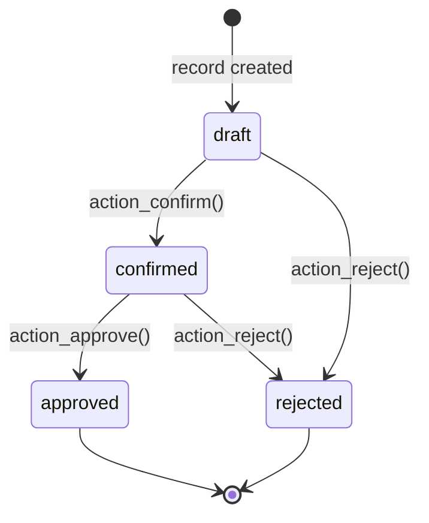

# State machine

Every `zonaweb.bidding.request` record moves through a four-state lifecycle. State changes are triggered by action methods called from header buttons in the Odoo form view, and every transition is automatically logged in the chatter because the `state` field has `tracking=True`.

## States

| State key | Label | Meaning |
|---|---|---|
| `draft` | Borrador | Initial state. The request has been received but not yet reviewed. |
| `confirmed` | Confirmado | A team member has acknowledged the request and it is under consideration. |
| `approved` | Aprobado | The request has been accepted; a proposal or contract will be prepared. |
| `rejected` | Rechazado | The request has been declined. This is a terminal state. |

## State diagram



<Tip>
  `approved` and `rejected` are terminal states. No action methods transition away from them. If you need to reopen a record, update `state` directly in the backend or extend the model with an additional `action_reset_to_draft` method.
</Tip>

## Action methods

### `action_confirm()`

Transitions the record from `draft` to `confirmed`.

```python
def action_confirm(self):
    self.write({'state': 'confirmed'})
    return True
```

- **Allowed from:** `draft`
- **Resulting state:** `confirmed`
- **Chatter:** logs the state change from *Borrador* to *Confirmado*

### `action_approve()`

Transitions the record from `confirmed` to `approved`.

```python
def action_approve(self):
    self.write({'state': 'approved'})
    return True
```

- **Allowed from:** `confirmed`
- **Resulting state:** `approved`
- **Chatter:** logs the state change from *Confirmado* to *Aprobado*

### `action_reject()`

Transitions the record from `draft` or `confirmed` to `rejected`.

```python
def action_reject(self):
    self.write({'state': 'rejected'})
    return True
```

- **Allowed from:** `draft` or `confirmed`
- **Resulting state:** `rejected`
- **Chatter:** logs the state change to *Rechazado*

<Warning>
  None of the action methods validate the current state before writing. If you call `action_approve()` on a `draft` record programmatically, it will succeed. Button visibility rules in the form view enforce the intended flow for interactive users, but custom code should check `state` explicitly if transitions need to be guarded.
</Warning>

## Button visibility rules

The form view header defines three buttons. Each is hidden or shown based on the current `state` value using Odoo's `invisible` attribute.

```xml
<button name="action_confirm" type="object" string="Confirmar"
    class="btn-primary" invisible="state != 'draft'"/>
<button name="action_approve" type="object" string="Aprobar"
    class="btn-success" invisible="state != 'confirmed'"/>
<button name="action_reject" type="object" string="Rechazar"
    class="btn-danger" invisible="state not in ['draft', 'confirmed']"/>
```

| Button | Label | Visible when | CSS class |
|---|---|---|---|
| `action_confirm` | Confirmar | `state == 'draft'` | `btn-primary` |
| `action_approve` | Aprobar | `state == 'confirmed'` | `btn-success` |
| `action_reject` | Rechazar | `state in ['draft', 'confirmed']` | `btn-danger` |

<Note>
  The **Rechazar** button is intentionally available from both `draft` and `confirmed`. This lets reviewers decline a request at any point before approval without needing to confirm it first.
</Note>

## Status bar

The `state` field is rendered as a `statusbar` widget in the form view header:

```xml
<field name="state" widget="statusbar"
    statusbar_visible="draft,confirmed,approved,rejected"/>
```

All four states are always visible in the progress bar, so users can see the full lifecycle at a glance regardless of the current state.

## Chatter tracking

Because `state` is defined with `tracking=True`, Odoo automatically creates a chatter message every time the field value changes:

```python
state = fields.Selection([
    ('draft', 'Borrador'),
    ('confirmed', 'Confirmado'),
    ('approved', 'Aprobado'),
    ('rejected', 'Rechazado'),
], string='Estado', default='draft', tracking=True)
```

The log entry records the old and new label (e.g. *Borrador → Confirmado*), the user who made the change, and the timestamp. No extra code is required — the `mail.thread` mixin handles this automatically.

## List and kanban badges

In the list and kanban views, `state` is rendered as a coloured `badge` widget:

| State | Badge colour |
|---|---|
| `draft` | Default (grey/muted) |
| `confirmed` | Warning (yellow/orange) |
| `approved` | Success (green) |
| `rejected` | Danger (red) |
