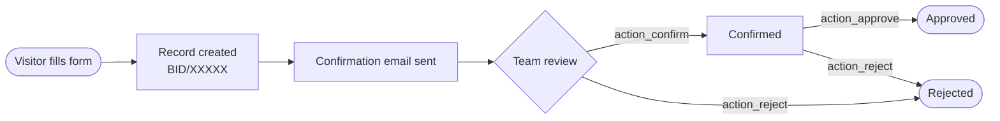

The bidding system lets prospective clients submit a quote or proposal request (licitación) directly from the Zonaweb website. Each submission creates a tracked record in Odoo with a unique reference number, triggers an automatic confirmation email, and enters a review workflow managed by the backend team.

## What is a licitación?

A **licitación** (bidding request) is a structured inquiry from a prospect who wants a custom service proposal. Rather than a generic contact form, it captures structured data — service type, estimated budget, timeline, sector — that the sales team needs to prepare a detailed offer.

Requests are stored in the `zonaweb.bidding.request` model and are accessible at **Sales > Licitaciones > Solicitudes** in the Odoo backend.

## Lifecycle

Every bidding request moves through four states:

| State | Label | Description |
|---|---|---|
| `draft` | Borrador | Default state when the form is submitted. |
| `confirmed` | Confirmado | A team member has reviewed and confirmed the request. |
| `approved` | Aprobado | The request has been accepted and a proposal will be prepared. |
| `rejected` | Rechazado | The request has been declined. |

## Step-by-step flow

<Steps>
  <Step title="Visitor submits the form">
    The prospect fills out the form at `/licencias` and posts it to `/submit-bidding`. All required fields must be present or the controller raises an error.
  </Step>
  <Step title="Record created with sequence reference">
    Odoo creates a `zonaweb.bidding.request` record. The `ir.sequence` with code `zonaweb.bidding.request` assigns a reference in the format `BID/00001`, `BID/00002`, etc.
  </Step>
  <Step title="Confirmation email sent">
    The controller immediately sends the `email_template_bidding_confirmation` template to the prospect's email address. If the send fails, the error is logged as a warning and the submission still succeeds.
  </Step>
  <Step title="Backend team reviews">
    The record appears in the list/kanban view at **Sales > Licitaciones > Solicitudes** with state **Borrador**. A team member opens the form and clicks **Confirmar**.
  </Step>
  <Step title="Approve or reject">
    From the **Confirmado** state, the team clicks **Aprobar** or **Rechazar**. A draft record can also be rejected directly without confirming first.
  </Step>
</Steps>

## Chatter tracking

The model inherits `mail.thread` and `mail.activity.mixin`, so every state transition and change to tracked fields is automatically logged in the Odoo chatter. The following fields are tracked:

- `company_name`
- `contact_name`
- `email`
- `state`

## Related pages

<CardGroup cols={2}>
  <Card title="Form submission" icon="file-pen" href="/bidding/form-submission">
    Route details, field validation, error handling, and the thank-you page.
  </Card>
  <Card title="Email notifications" icon="envelope" href="/bidding/email-notifications">
    The automatic confirmation email template and its fallback behaviour.
  </Card>
  <Card title="Backend management" icon="table-columns" href="/bidding/backend-management">
    List view, form view, kanban view, and action buttons.
  </Card>
</CardGroup>
